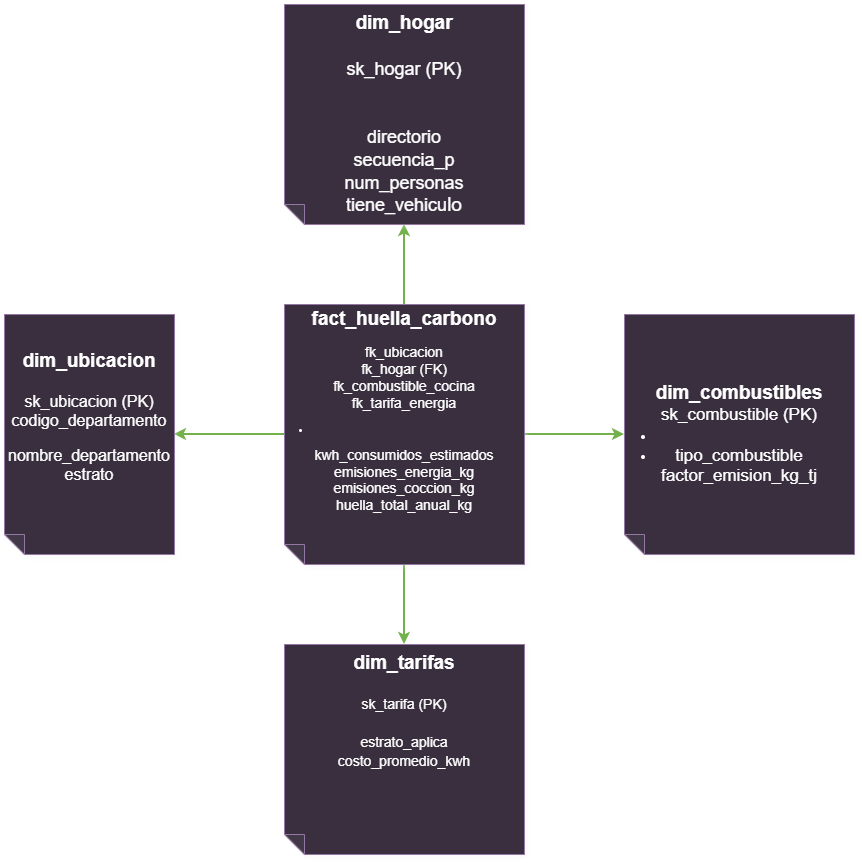
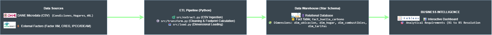

# ETL Project: Data Engineering for Sustainable Development in Colombia
**Course:** ETL (G01) - Universidad Autónoma de Occidente  
**Phase 1:** From Analytical Requirements to a Dimensional Data Warehouse  

---

## 1. Colombian Problem Definition & SDG
* **Selected SDG:** SDG 12 - Responsible Consumption and Production.
* **Relevant Target:** By 2030, achieve the sustainable management and efficient use of natural resources, promoting lifestyles in harmony with nature.
* **Context and Problem Statement:** In Colombia, the measurement of residential carbon footprint is often addressed fragmentarily or at a macroeconomic level, hindering the identification of key household emission hotspots (such as electric power consumption, cooking methods, and transportation). This project analyzes microdatos from Colombian households to quantify and characterize their direct environmental impact, scoping the study to the national and residential sector level.
* **Stakeholders / Users:** Ministry of Environment and Sustainable Development, National Planning Department (DNP), regional authorities, and academic entities dedicated to planning energy transition and sustainability policies.

## 2. Objective and Analytical Requirements (R1 - R5)
The analytical objective of this solution is to structure a dimensional Data Warehouse based on DANE's National Quality of Life Survey (ECV) and official factors, fulfilling the following business needs:

| ID | Analytical Requirement | Business Question | Supported Decision / Finding |
| :--- | :--- | :--- | :--- |
| **R1** | Electric Power Footprint | What is the average carbon footprint from electricity consumption by socioeconomic stratum (estrato)? | Supports targeted design of savings incentives and energy subsidies. |
| **R2** | Cooking Fuel Emissions | How do departmental emissions vary according to the type of fuel used for cooking (gas, propane, or firewood)? | Evaluates the effectiveness of firewood-to-gas substitution programs. |
| **R3** | Private Vehicle Impact | What is the percentage weight of private vehicles in total household emissions? | Guides urban sustainable mobility plans and clean technology transition. |
| **R4** | Geographic Prioritization | Which municipalities or departments have the highest per capita residential carbon footprint generation? | Allows prioritizing resource allocation for regional environmental campaigns. |
| **R5** | Efficiency by Household Size | Is there a direct relationship between the number of household members and per capita emission efficiency? | Underpins environmental education programs focused on responsible consumption. |

## 3. SDG Alignment
The project aligns directly with SDG 12 targets by providing visibility into household energy and material consumption. By linking ECV survey data with official emission factors (XM and IPCC/IDEAM), the solution transcends simple survey visualization and becomes an analytical tool for decision-making aimed at reducing material footprints in Colombia.

## 4. Data Source Selection and Evaluation
* **Primary Source:** Microdatos from the National Quality of Life Survey (ECV) - DANE.
* **Secondary Sources (Reference Dimensions):**
  * XM electricity emission factor ($0.097 \text{ kg CO}_2\text{e/kWh}$).
  * Official IPCC / IDEAM factors for fuels (Firewood, Propane, Natural Gas).
  * Unit energy costs based on CREG tariffs per stratum.
* *(Note: The detailed dataset suitability matrix is documented in the initial data profiling report).*

## 5. Data Profiling and Quality
* Exploratory analysis and diagnostics of nulls, duplicates, and data types executed in `notebooks/data_profiling.ipynb`.
* Cleaning and imputation strategy implemented within the Python pipeline.

## 6. Granularity Declaration and Dimensional Model (Star Schema)
* **Granularity Declaration:** *"A row in the Fact Table represents the estimated annual measurement of the carbon footprint for a specific Colombian household, uniquely identified by the survey control variables (DIRECTORIO and SECUENCIA_P)."*
* **Star Schema Diagram:**  
  
  
## 7. System Architecture (ETL Pipeline)
* **Architecture Flow Diagram:**
  

## 8. ETL Pipeline and Data Warehouse
* **Technologies:** Python (Pandas/SQLAlchemy), PostgreSQL / MySQL.
* **Execution Instructions:**
  1. Clone the repository.
  2. Install dependencies: `pip install -r requirements.txt`.
  3. Run the main pipeline: `python src/main.py`.

## 9. Analytical Queries (SQL) and KPIs
The scripts containing formal queries against the Data Warehouse to solve requirements R1-R5 are located in [`sql/analytical_queries.sql`](sql/analytical_queries.sql).

## 10. Business Intelligence (BI) and Analytical Findings
* **Visualization:** Interactive dashboard connected to the Data Warehouse.  
  *(Pending to attach the `dashboard.png` image in the `docs/` folder)*
* **Key Findings:**  
  1. *(To be defined after dashboard execution)*.
  2. *(To be defined)*.
  3. *(To be defined)*.